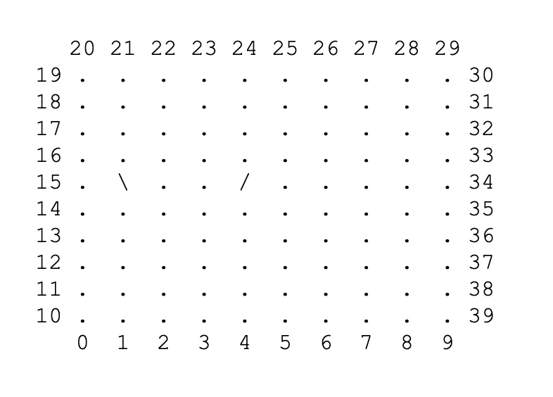

# Lab 11
### Black Box Challenge

#### Objectives: 
Re-inforce knowledge of 2D Arrays and recursion

A 1978 Parker Brothers board game called “Black Box” involved locating deflecting baffles within the black box.   The box can be represented by a 10 x 10 character array.

Ten mirrors, denoted by ‘/’ or ‘\’ are placed randomly on the board.  Two of them are shown at  (1, 15) and (4,15).  (We will refer to them by the (bottom, left) coordinates.  

The numbers around the perimeter of the box represent lasers that shoot into the box.  When you shoot the laser it will emerge at some other numbered position.  For example, if laser 24 is shot it will emerge at position 21, having been deflected by both shown baffles.  In like manner, laser 4 will come out at 34.  

When you play the game the user has three options to choose from after the board and shot statistics has been shown:
	

    Choose:
		 (1) Shoot a Laser
		 (2) Guess at a mirror location
		 (0) Quit the game
	
	Enter choice:

(1) Prompts the user for a number from 0 - 39 and outputs where the **shot** comes out.

(2) Prompts the user for 2 numbers from 0 - 39 that indicate a specific location on the 	
board and tells the user if **guessed** a mirror location or not.  Outputting it on board if true.

(3) A secret hidden command to display the board with all mirrors visible. (Cheat Code)

(0) Obvious 

- Once a mirror location is guessed correctly, it is then shown each time the board is displayed.  The objective is to find all 10 mirrors with the fewest number of incorrect guesses and shots.

- Your program should keep shot statistics: number of shots and guesses.  Display after each round.  

    You have found 4 of 10 mirrors
    You have shot 19 Lazers
	
    Choose:
       (1) Shoot a Laser
	   (2) Guess at a mirror location
	   (0) Quit the game
	
	Enter choice:

- This program is to include a recursive method for shooting (checking of mirror locations.)  There should also be a minimum of 3 other methods not including main.  Perhaps Displaying the board, SettingUp the Board, GamePlay.

***

### Scoring Guide

| Requirement | Possible Points |
| :---        |    :----:   | 
| On time submission | 4 | 
| Header filled in with name, block, etc. | 2 |
| Correctly uploaded zipped replit project to Google Classroom | 2 |
| Properly create and fill the game board | 5 |
| Correctly set 10 random mirrors in random locations | 5 |
| Proper and **efficient** display of the game board | 5 |
| Properly written recursive laser method| 0 |
| Proper game play | 0 |
| Properly execute hiden Cheat Code| 2 |
| Proper looping menu with correct game stats| 0 |
| **Total:** | **25** |

***  
